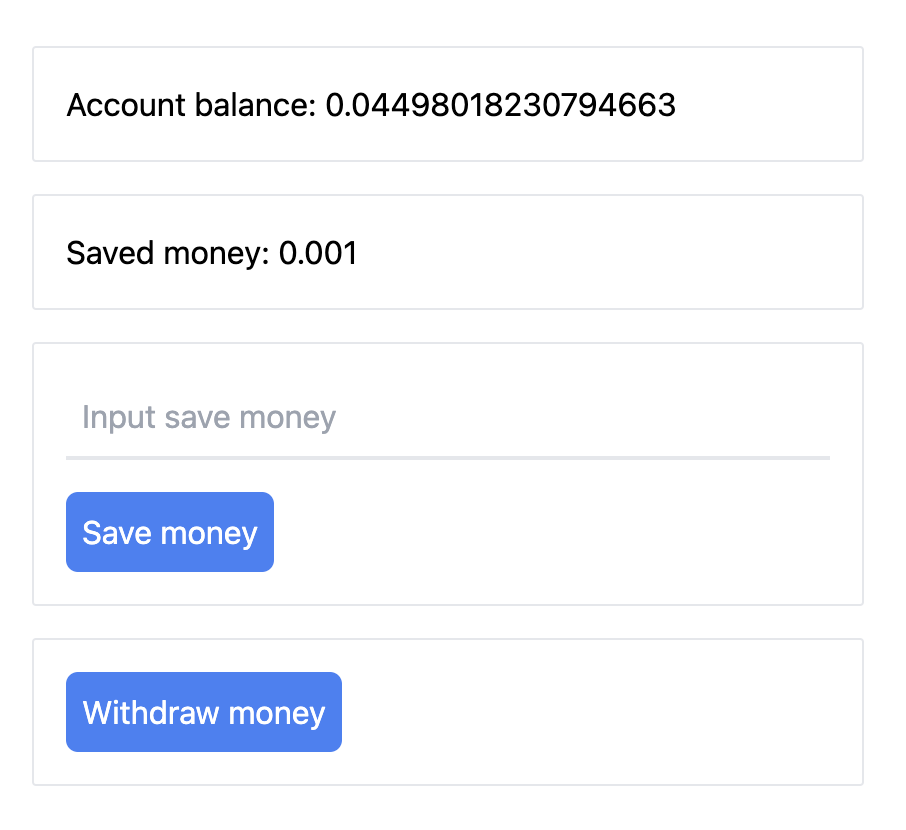

# Intro
极为简单的一个小练习，功能点：  
1. 连接钱包，获取余额，存储，提取
2. 合约类似于储蓄罐，无限次存入金钱，取出时一次性取出



# Run
```
cd smart_contract 
npx hardhat compile
npx hardhat run scripts/deploy.js --network goerli

cp artifacts/contracts/Lucky.sol/Lucky.json ../client/src/utils
# copy deploy deployed to ../client/src/utils/constants.ts/contractAddress
cd ../client
npm run dev
```

# Reference
- [https://youtu.be/Wn_Kb3MR_cU](https://youtu.be/Wn_Kb3MR_cU)
- [https://docs.metamask.io/](https://docs.metamask.io)
- [https://hardhat.org/tutorial/deploying-to-a-live-network](https://hardhat.org/tutorial/deploying-to-a-live-network)
- [https://docs.soliditylang.org/](https://docs.soliditylang.org/)